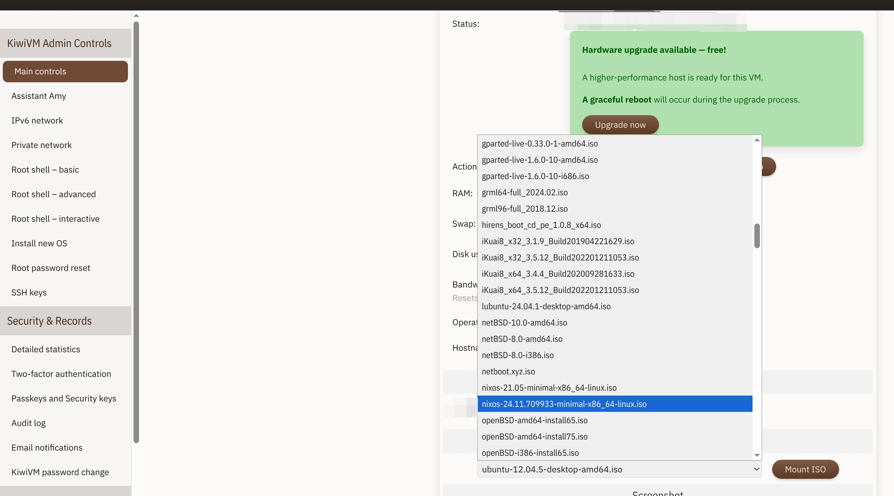
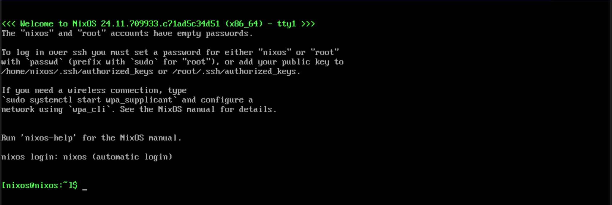

+++
title = "在 VPS(KiwiVM) 上安装 NixOS"
date = "2025-07-11"

[extra]
comment = true
+++

# 挂载镜像
进入 KiwiVM 的控制台首页，将 VPS 关机后，找到 Mount ISO，选择 NixOS 的镜像并挂载



系统会提示 VPS 必须要关机，镜像挂载才会生效
<image src="mount-iso-hint.png" alt="mount-iso-hint" style="width: 70%; height: auto;">

启动 VPS，系统会自动打开 VNC 窗口，等同于点击左边的 `Root shell - interactive` 然后点 `Launch` 打开



# 安装 NixOS

我使用的 VPS 不支持 UEFI 启动，所以下文使用 BIOS Boot


切换到 root 用户
```sh
sudo su -
```

检查磁盘分区情况，使用 `lsblk` 命令查看
```sh
lsblk
```

对磁盘分区，使用 `parted` 命令
```sh
parted /dev/sda  # 分区该设备, sda需要根据实际情况修改
mklabel gpt  # 创建 GPT 表
mkpart BIOS fat32 1MiB 512MiB  # 在 1 MiB - 512 MiB 的位置创建引导分区
set 1 bios_grub on  # 将序号为 1 的分区标识为可启动
mkpart primary 512MiB -2GiB  # 在自 512MiB 至分区尾前 2GiB 的位置创建主分区
mkpart primary linux-swap -2GiB 100%  # 余下的 2GiB 用于创建交换分区
p  # 确认当前分区情况
quit  # 退出
```

BIOS Boot 实际不需要这么大的引导分区(分区1)，这个大小其实是给 UEFI 模式准备的


格式化分区，使用 `mkfs` 命令

bios_grub 的分区不需要格式化, 也不用挂载

```sh
mkfs.ext4 -L nixos /dev/sda2 # 设置主分区
mkswap -L swap /dev/sda3  # 设置交换分区
mount /dev/sda2 /mnt  # 将根分区挂载到 /mnt 下
swapon /dev/sda3  # 启用交换分区
```

生成 NixOS 配置
```sh
nixos-generate-config --root /mnt
```

修改 NixOS 配置
```sh
vim /mnt/etc/nixos/configuration.nix
```
```nix
{ outputs, config, lib, pkgs, ... }:
{
  imports = [
    ./hardware-configuration.nix
  ];

  boot.loader.grub.enable = true;
  boot.loader.grub.device = "/dev/sda";

  services.openssh.enable = true;
  system.stateVersion = "24.11"; # 这里按照生成的文件默认的配置，不要更改！！！
}
```

部署系统
```sh
nixos-install # 这一步比较费时，需要耐心等待
```

进入系统
```sh
nixos-enter  # 进入部署好的系统，类似 arch 的 chroot
passwd root  # 重置 root 密码，因为听说 nixos-enter 设置的密码可能不生肖
useradd -m -G wheel yourname  # 添加普通用户，并加入 wheel 组
passwd yourname  # 设置普通账户密码
```

关机
```sh
exit
shutdown now
```

# 安装完成

返回 KiwiVM 控制台，卸载 ISO 镜像，然后启动 VPS
<image src="umount-iso-hint.png" alt="mount-iso-hint" style="width: 70%; height: auto;">

这样就完成了 NixOS 的安装，可以远程登陆系统了
```sh
ssh yourname@your-ip-address
```

本文撰写参考了以下资料，感谢作者们的辛勤付出:
- [NixOS 中文](https://nixos-cn.org/tutorials/installation/VirtualMachine.html)
- [NixOS & Flakes Book](https://nixos-and-flakes.thiscute.world/zh/introduction/installation)
